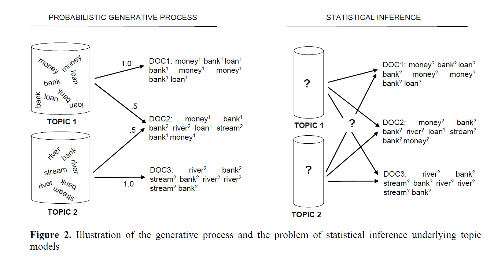
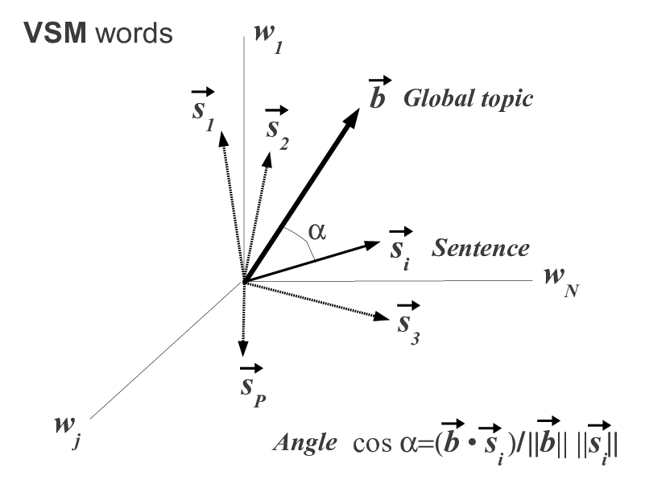
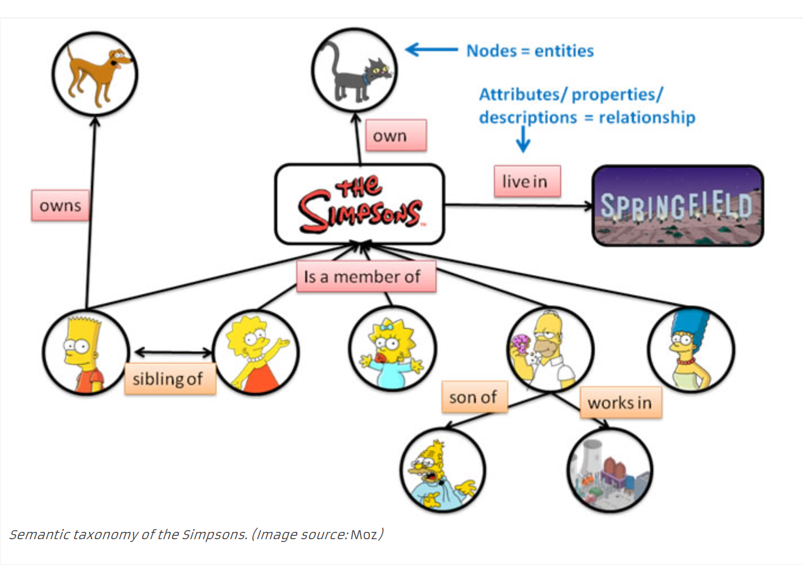
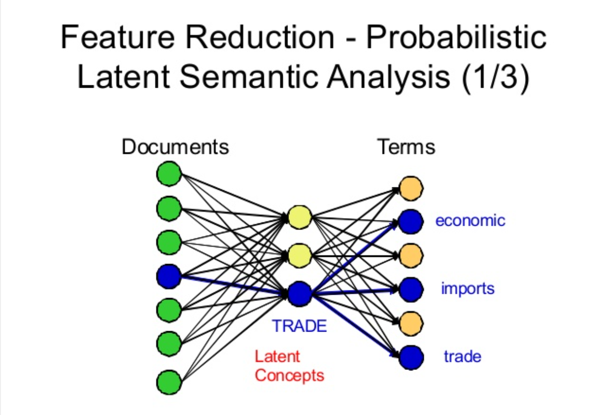
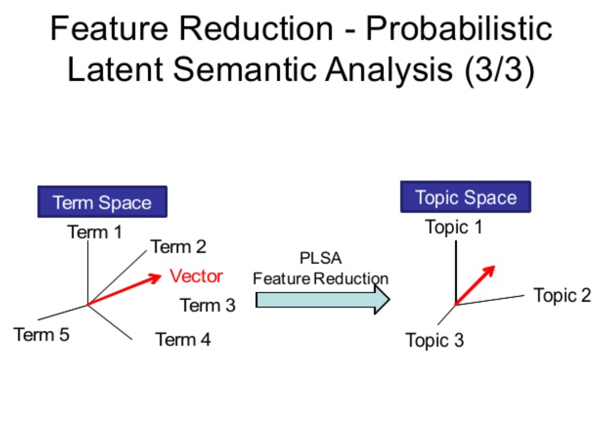
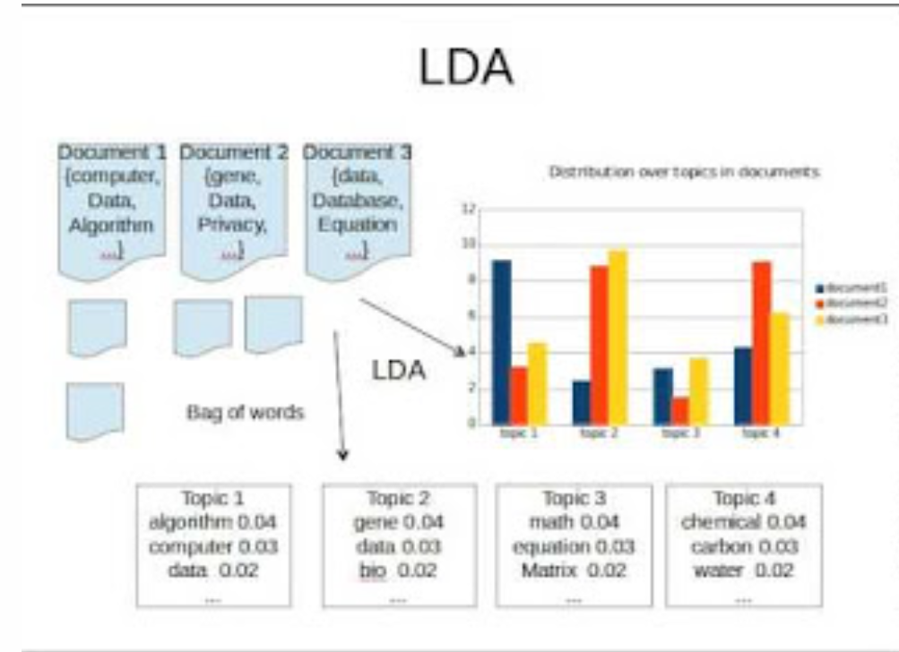

```{r setup1, include=FALSE}
knitr::opts_chunk$set(echo = TRUE)
```

## 

The goal of topic modeling is to find the concepts that run through documents by analyzing the words of the texts.
Topic modeling is a powerful technique for analysis of a huge collection of documents. Topic modeling is used for discovering hidden structure from a collection of documents. A topic model is considered a powerful tool similar to clustering or classification approaches. It can model objects as latent topics that reflect the meaning of a collection of documents. The topic is viewed as a recurring pattern of co-occurring words. A topic includes a group of words that often occurs together. Topic modeling can link words with the same context and differentiate across the uses of words with different meanings. Some common methods of Topic Modeling include Vector Space Model (VSM), Latent Semantic Indexing (LSI), Probabilistic Latent Semantic Analysis (PLSA) and Latent Dirichlet Allocation (LDA). [(1)](https://ieeexplore.ieee.org/document/8250563)

Approached two different ways:

1. Generative model (only information relevant to the model is the number of times words are produced)-bag of words assumption

2. Problem of statistical interference

<center>
[(2)](http://psiexp.ss.uci.edu/research/papers/SteyversGriffithsLSABookFormated.pdf)
</center>

Topic modeling is a technique to extract abstract topics from a collection of documents. In order to do that, the input document-term matrix is usually decomposed into 2 low-rank matrices: the document-topic matrix and topic-word matrix. 

###Vector Space Model (VSM)

<center>
[(3)](https://www.researchgate.net/figure/The-global-topic-in-a-Vector-Space-Model-of-N-words_fig1_232144781)
</center>
Vector space model is a typical solution for keyword searches. It represents the document as a vector where each entry corresponds to a different word and the number at that entry corresponds to how many times that word is present in the document. [(4)](https://ieeexplore.ieee.org/document/8250563)
 
###Latent Semantic Indexing (LSI)/Latent Semantic Analysis (LSA)

<center>
[(5)](https://www.popwebdesign.net/popart_blog/en/2018/07/latent-semantic-indexing/)
</center>

Latent Semantic Analysis (LSA) is an approach to automatic indexing and information retrieval that attempts to overcome some problems with VSM by mapping documents as well as terms to a representation in the so-called latent semantic space. LSA usually takes the (high-dimensional) vector space representation of documents based on term frequencies as a starting point and applies a dimension reducing linear projection. The specific form of this mapping is determined by a given document collection and is based on a Singular Value Decomposition (SVD) of the corresponding term/document matrix. The general claim is that similarities between documents or between documents and queries can be more reliably estimated in the reduced latent space representation than in the original representation. The rationale is that documents which share frequently co-occurring terms will have a similar representation in the latent space, even if they have no terms in common. LSA thus performs some sort of noise reduction and has the potential benefit to detect synonyms as well as words that refer to the same topic. In many applications this has proven to result in more robust word processing. [(6)](https://ieeexplore.ieee.org/document/8250563)

LSI (Latent Semantic Indexing) is a way that search engines determine whether your content is really on-topic and in-depth or just spam. The search engines determine this by looking at the words in an article and deciding how relevant they are to each other. 

An example is a web search of "windows." If you are searching for "windows", there are hundreds of related keywords that you can think of:

"Bill Gates"

"Microsoft"

"Windows 10"

"Surface tablet"

These keywords are naturally grouped together and rightly so as these are the potential LSI keywords when writing a post about "windows."

LSI also helps to differentiate from the "other" windows:

"Window cleaning"

"Double glazed windows"

"Wooden windows"

"Window locks"
[(7)](https://iamahmedkhalifa.com/blog/latent-semantic-indexing/)
  

###Probabilistic Latent Semantic Indexing (pLSI/pLSA)

<center>

 [(8)](https://www.slideshare.net/JIAMINGCHANG/2008-0117-psldocslides)
</center>

Probabilistic Latent Semantic Indexing is a novel approach to automated document indexing which is based on a statistical latent class model for factor analysis of count data. Fitted from a training corpus of text documents by a generalization of the Expectation Maximization algorithm, the utilized model is able to deal with domain specific synonymy as well as with polysemous words. In contrast to standard Latent Semantic Indexing (LSI) by Singular Value Decomposition, the probabilistic variant has a solid statistical foundation and defines a proper generative data model. Retrieval experiments on a number of test collections indicate substantial performance gains over direct term matching methods as well as over LSI. In particular, the combination of models with different dimensionalities has proven to be advantageous. [(9)](http://delivery.acm.org/10.1145/320000/312649/p50-hofmann.pdf?ip=129.92.250.40&id=312649&acc=ACTIVE%20SERVICE&key=92909D146075CF59%2E296EECC507F02D9A%2E4D4702B0C3E38B35%2E4D4702B0C3E38B35&__acm__=1541182801_f7fbacceee3dcf5afd0b6ba73999fe0b)

###Latent Dirichlet Allocation(LDA) 
<center>
[(10)](https://kdnuggets.com/2016/07/text-mining-101-topic-modeling.html)
</center>
Latent Dirichlet Allocation (LDA) treats each document as a mixture of topics and each topic as a mixture of words.  LDA estimates both the mixtures at the same time and creates a mixture of topics that describe each document. 

[LDA broken down](https://medium.com/@lettier/how-does-lda-work-ill-explain-using-emoji-108abf40fa7d)

```{r, child='TopicModeling.Rmd'}
```