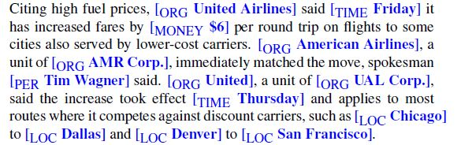
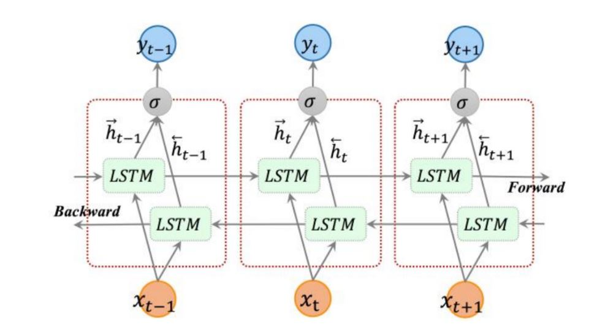

```{r setup, include=FALSE, echo=FALSE}
knitr::opts_chunk$set(echo = TRUE,
                      message = F,
                      warning = F, 
                      comment = NA)

```

# Introduction

## Motivation

Suppose we care to extract the people, organizations, or locations mentioned in a particular section of text and how they relate to each other in the context of the document.  In the Harry Potter texts, we could attempt to gain insight about particular chapters or particular books when looking at which named entities are mentioned the most, when they are mentioned, or what other entities (or particular parts of speech) are mentioned in close sequence.  

In Bryan's project, he is looking at the last 25 years' worth of State of the Union Addresses to see what trends exist across presidents and parties.  In addition to document summarization to generate a condensed version of each speech and topic modeling to "decode" the different common topics across the speeches, he could further analyze the text to see who and what each president mentions, how often, and in what context.  

The goal of Named Entity Recognition (NER) is the process of finding spans of text that constitute proper name then classify the type of entity. Named entities are anything that can be referred to with a proper noun: a person, a location, or an organization.  They have also been extended to include dates, times, and numerical expressions. Named entities can give insight to events in text, relationship between people in a text, and aid in other text mining techniques. For example, we may want to conduct sentiment analysis towards a certain entity. The following table displays a list of generic named entity types with the kind of entities they refer to. 

<center>

</center>

Let's take one in class exercise and see what entities we come up with, and see what challenges and potential other text mining techniques we could use after NER.

One further example:

<center>
 
</center>

The example shown above blends NER, event coreference (which events mentioned in a document are the same event), temporal expressions (days of the weeks, months), entity linking (United Airlines vs. United).  While this lesson only delves into NER, this example shows some of the things that could be extracted to answer a question like: "Is there any relationship between one airline changing fare price followed by others doing to same thing?"

With the United Airlines example above, NER can break it down into the following entities based on their entity type.
<center>

</center>

There are challenges when trying to perform named entity recognition. It is difficult to segment the text correctly to identify what is and isn't an entity. It is also hard to identify the type of entity for a given word. For example, the entity JFK could be used for the airport, a person, schools, bridges, street names, or even a movie. 

## NER as Sequence Labeling

A word-by-word sequence labeling task is the most common algorithm for performing NER. Sequence labeling is simply trying to assign a label to each element of a sequence chosen from a small fixed set of labels. The assigned tags capture both the boundary and the entity type. There are two formats that entities can be tagged: IOB and IO tagging. IOB tagging introduces a tag for the beginning (B) and inside (I) of each entity type, and one for tokens outside (O). This results in _2n+1_ tags for _n_ entities. IO tagging doesn't identify the B tags, and thus isn't able to distinguish between two entities of the same type right next to one another. This is rarer so typically IO tags are sufficient. IO tagging is simpler as it only produces _n+1_ tags. Below we'll see a sentence broken down into IOB and IO tagged entities. 

[ORG __American Airlines__], a unit of [ORG __AMR Corp.__], immediately matched the move, spokesman [PER __Tim Wagner__] said.

This sentence is tagged and below are the associated IOB and IO labels broken down.

<center>

</center>

The next sections all cover the standard algorithms for NER.

# Types of NER

## Feature-based NER

These algorithms use various features as inputs/predictors for the labeling of entity tags, similar to PoS tagging. Some common features are word shape, gazetteer presence (binary), prefix/suffix, words within a given window of the word in question (context), and sometimes POS although some researchers find this not to be a useful feature. Word shape features represent the letter patterns of a word by mapping lower-case letters to 'x', upper case letters to 'X', numbers/digits to 'd', and retaining punctuation. 

For example 'I.M.F' would be represented as X.X.X and 'DC10-30' would be represented as XXdd-dd.

Gazetteers act as entity type dictionaries. In practice this means that membership to a gazetteer acts as a binary feature in that if a word matches an entry in a list of locations then its membership adds to the probability that the word will be tagged as a location. The effectiveness of gazetteers varies greatly from situation to situation and they can be very difficult to maintain. 

Prefixes and suffixes are also used as word features, as well as word embeddings (mapping of words to vectors) or the word in question and neighboring words, word identities of the word in question and neighboring words.

<center>

</center>


The first model that is commonly used for this task is the Maximum Entropy Markov Model (MEMM). Just as with POS tagging, MEMMs are preferred to HMMs due to the fact that they are discriminative as opposed to generative.  Additionally, it is far easier to incorporate the use of many features in predicting tags since they compute the posterior directly (intuition for this is found in Jurafsky pg. 168). Additionally, the MEMM model relaxes the assumption of tag independence present in HMMs. 

Conditional Random Fields (CRFs) are the other commonly used feature-based model; it is also discriminative and does not assume independence between tags. CRFs have a number of advantages over MEMMs; they are able to take into account future words/features, as well as address the label bias problem inherent in MEMMs. The label bias problem arises because transitions out of any one state to the next compete only against one another, making it so that there is a bias toward states with few transition arcs. Conditional random fields normalize transition probabilities globally over entire sequence which eliminates the label bias problem. 

Very generally, CRFs can be thought of as F:X-->Y, a function F takes a set of features X and assigns probabilities of membership to a various tag types Y. The function does not act time step by step but rather acts over a window of tokens allowing it to utilize context. 

<center>

</center>

Each of the feature-based models use the same Viterbi algorithm to find the probability of the best tag sequence. A sequence classifier like an MEMM can be trained to label new sentences. In the below example, the operation of a sequence labeler is at the point where the token _Corp._ is next to be labeled. Everything in the boxed area is the features available to the classifier.


<center>

</center>


## Neural Algorithm for NER

As CRFs have to rely on gazetteers and lists, this is a sub-prime solution as there are numerous flaws with these lists in terms of the costs of maintaining and updating the lists as well as lists not capturing every entity.  NLP experts have begun to use recurrent neural networks for NER because of their ability to handle sequential data. 

The neural algorithm normally used for NER is a bi-directional Long Short Term Memory (bi-LSTM) which divides the text into two portions: one in which the data is no longer needed and "discarded" and one which keeps information that will likely be used later.  Of the words it keeps, it maps each of the words into their word embeddings (which are vectors of real numbers).  This can be accomplished in numerous packages like word2vec.

The neural net then uses the bi-directional LSTM layers which read each embedding and give an output after each hidden layer.  A dense layer then takes its weights and maps outputs of the bi-LSTM layers to a *n*-dimensional vector of logits and probabilities, thus identifying the entity, entity type, and non-NER tokens.  

Two graphical depictions of the bi-LSTM model are shown below:

<center>

</center>

<center>

</center>


The benefits of using a bi-direction neural net is that not only are words after the token of interest considered, but words before the token of interest are also considered, allowing the model to uncover more patterns in the data.(4)  This makes the RNN much more accurate, with a much higher $F_1$ measure than a normal LSTM model.  

## Rule-based NER

Machine learned (neural or MEMM/CRF) sequence models are common in academic research, but for commercial use, NER is often based on pragmatic combinations of lists and rules. These lists or rules are either hand-coded or developed from examples. Typical rule-based systems consist of:

* a collection of rules
* a set of policies to control the firing of multiple rules

Single-entry rules tend to have the form _Contextual Pattern_ -> _Action_. Take for example the line "at 3 pm will". A rule could be implemented to identify the entity "3 pm" as a standard time. The rule would first look for a pre word of "at", a fill of a positive digit and then a time id, and post part of speech auxiliary verb (AUX). 

Rule-based NER will typically make repeated passes over text and uses previous results of one pass to influence the next. 

1. Use high-precision rules to tag unambiguous entity mentions.
2. Search for substring matches of the previously detected names.
3. Consult application-specific name lists to identify likely name entity mentions from the given domain.
4. Apply probabilistic sequence labeling techniques that make use of the tags from previous stages as additional features.

These more in depth steps of rule based incorporate multiple entity rules and which rules should be applied over a larger span of text (longer entities). 

## Evaluation Methods

NER systems are evaluated by recall, precision, and $F_1$ measure. Recall is the ratio of the number of correctly labeled responses to the total that could have been labeled in the text. It is the measure of how much relevant information the system has extracted (coverage of system). 

Precision is the ratio of the number of correctly labeled responses to the total actually labeled by the system. It is the measure of how much of the information the system returned is correct (accuracy). The F-measure is the harmonic mean of the two. These metrics all treat the entities as the response rather than the words.

There is mismatch between the training and test conditions that develops from using the entities as the response units. Also, the segmentation done in NER can create undue error. For example, identifying the entity _American_ as an organization instead of _America Airlines_ would cause two errors:

* a false positive for an Organization entity
* a false negative for I-Organization (Airlines)

## Applications of NER

NER can be used to filter out entities from documents and then further NLP tasks can be performed on the entities, such as:

* Question answering
* Text summarization
* Sentiment analysis

Search engine algorithms can apply NER to shorten the lengthy query of articles. NER can be applied to each article and entities saved to identify a given article. The key tags in the search query can then be compared with the tags associated with the website articles for a quick and efficient search. 

Recommendations on websites can be developed using NER to automatically filter relevant content a person might want to view. The entities associated with content in someone's history can be compared with labels assigned to other content to make recommendations.

NER can aid a company's hiring process by simplifying resumes down to entities. A company's customer service complaints or feedback can be classified by their entities and directed to the proper departments.   

# Examples

# Conclusions

NER, much like parts of speech, has many uses in and of itself but can also be used to filter documents and run further NLP tasks on.  Though NER can be very helpful to gain insight about a document or use it as a filter to perform other NLP tasks, it is certainly not without its faults.  Language complexities, different abbreviations, and a vast array of entities having many different meanings will always make NER very difficult.  Advancement of neural networks and updated lists and gazetteers will continue to make NER more accurate but it is important for analysts to remember these neural networks and other modelling techniques won't be perfect.    


# References

1. Speech and Language Processing. Jurafsky, Daniel and Martin, James H. Draft Date: September 23, 2018.
2. [Named Entity Recognition: Applications and Use Cases](https://dzone.com/articles/named-entity-recognition-applications-and-use-case)
3. [Named Entity Recognition](https://www.kiv.zcu.cz/site/documents/verejne/vyzkum/publikace/technicke-zpravy/2012/tr-2012-04.pdf)
4. [Deep Learning for Named Entity Recognition #2: Implementing the state-of-the-art Bidirectional LSTM + CNN model for CoNLL 2003](https://towardsdatascience.com/deep-learning-for-named-entity-recognition-2-implementing-the-state-of-the-art-bidirectional-lstm-4603491087f1)
5. [Named Entity Recognition and the Road to Deep Learning](http://nlp.town/blog/ner-and-the-road-to-deep-learning/)
6. [A Review of Named Entity Recognition (NER) Using Automatic Summarization of Resumes](https://towardsdatascience.com/a-review-of-named-entity-recognition-ner-using-automatic-summarization-of-resumes-5248a75de175)
7. [Information Extraction: Lecture 3 – Rule-based Named Entity Recognition](http://www.cis.uni-muenchen.de/~fraser/information_extraction_2015_lecture/03_rule_based_NER.pdf)
8. [Conditional Random Fields - Stanford University (By Daphne Koller)](https://www.youtube.com/watch?v=rc3YDj5GiVM)
9. [An Intuitive Understanding of Word Embeddings](https://www.analyticsvidhya.com/blog/2017/06/word-embeddings-count-word2veec/)
10. [Statistical Methods for NLP](http://www.cs.columbia.edu/~smaskey/CS6998/slides/statnlp_week10.pdf)
11. [Conditional Random Fields: Probabilistic Models for Segmenting and Labeling Sequence Data](https://repository.upenn.edu/cgi/viewcontent.cgi?article=1162&context=cis_papers)
12. [OpenNLP Tutorial](https://www.tutorialspoint.com/opennlp/)
13. [An Introduction to Conditional Random Fields](http://homepages.inf.ed.ac.uk/csutton/publications/crftut-fnt.pdf)
