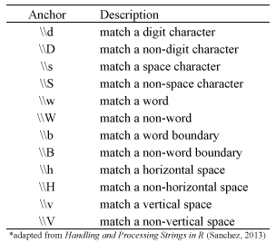
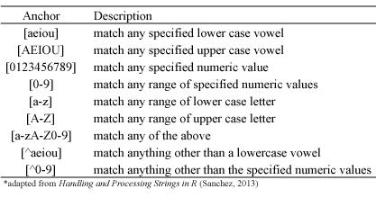

```{r, echo=FALSE}
library(stringr)
knitr::opts_chunk$set(echo = TRUE,
                      comment = NA,
                      message = F)
```

The term regular expression (aka regex) refers to a language for specifying an algebraic notation for characterizing a set of strings. Functions utilizing regular expressions are often used for pattern matching text strings within a single document or a corpus.  Typically, regex patterns consist of a combination of alphanumeric characters as well as special characters.  The pattern can also be as simple as a single character or it can be more complex and include several characters.  

To understand how to work with regular expressions in R, we need to consider two primary features of regular expressions.  One has to do with the *syntax*, or the way regex patterns are expressed in R.  The other has to do with the *functions* used for regex matching in R.  In this section, we will cover both of these aspects.  First, we'll dicsuss the syntax used to perform pattern matching functions with metacharacters, character & POSIX class objects, and quantifiers.  This will provide a basic understanding of the syntax required to establish the pattern to find.  Then, we'll cover the functions provided in both the `base` and `stringr` packages you can use to identify, extract, replace, and split parts of character strings based on the regex pattern specified. Finally, we'll apply these tools to a very unpopular U.S. Supreme Court ruling and dicsuss how to use regular expressions to locate features within the document.

Several packages will be used in this tutorial, the following code can be used to install and load the required packages from CRAN.

```{r}
pacman::p_load(pdftools,     # extract content from PDF documents
               XML,          # Working with XML formatted data
               here,         # References for file paths
               countrycode,  # Working with names of countries
               tibble,       # Creating and manipulating tibbles
               qdap,
               stringr,      # Tools for qualitative data
               DT)
```

One additional package that is not currently on CRAN, may be installed from Github using the code shown below.

```{r}
pacman::p_load_gh("VerbalExpressions/RVerbalExpressions")
```

## Regex Syntax

At first glance the regex syntax can appear quite confusing.  This section provides a basic foundation of regex syntax; however, realize that there are several resources available that will give you far more detailed, and advanced, knowledge of regex syntax, some of these are listed at the end of this document.  To read more about the specifications and technicalities of regex in R you can find help at `help(regex)` or `help(regexp)`.

### Metacharacters

When working with regular expressions in R, it's important to realize that there is a group of special characters called `metacharacters` that are used to perform other functions. The metacharacters are `. { ( ) \ ^ $ | ? * +`.  Note that the functions being performed by these metacharacters in R may not correspond with how they are used in other languages. 

Among these metacharacters, the backslash is important because if we wish to search for any of these characters without using their built in function we must <u>escape</u> the character with a backslash. To match metacharacters in R you need to escape them with a double backslash `\\`. Why a double backslash? Because the backslash is itself a metacharacter and must also be escaped. The examples show how to use the escape syntax to find and replace metacharacters.  For information on the `sub` and `gsub` functions used in this example visit the main regex functions section. 

```{r}
# substitute $ with !
sub(pattern = "\\$", "\\!", "I love R$")

# substitute ^ with carrot
sub(pattern = "\\^", "carrot", "My daughter has a ^ with almost every meal!")

# substitute \\ with whitespace
gsub(pattern = "\\\\", " ", "I\\need\\space")
```

### Matching Patterns Using Anchors

To match a pattern of characters we can use a short-hand notation, called anchors, to capture specific sequences in specific locations within the document.  Anchors, like metacharacters, are regex tokens in that they don't match any characters, but specify something about the string or the matching process. Anchors can be used to specify that a pattern's position in the string matches a defined location (i.e. the beginning of the string or the end of a line. 

Anchors are useful because they allow us to be expressive in specifying that we want to match digits at the end of a line, but not anywhere else. Anchors are also efficient as they tell the function to only search at given locations, rather than throughout the entire document. The image below displays the general syntax for using these anchor tokens in R.

<center>

</center>    
    
The following are simple examples showing how to use anchor tokens withe the `gsub()` function to find and replace patterns of characters. 

```{r}
# substitute any digit with an underscore
gsub(pattern = "\\d", "_", "I'm working in RStudio v.0.99.484")

# substitute any non-digit with an underscore
gsub(pattern = "\\D", "_", "I'm working in RStudio v.0.99.484")

# substitute any whitespace with underscore
gsub(pattern = "\\s", "_", "I'm working in RStudio v.0.99.484")

# substitute any wording with underscore
gsub(pattern = "\\w", "_", "I'm working in RStudio v.0.99.484")

# substitute any non wording with underscore
gsub(pattern = "\\W", "_", "I'm working in RStudio v.0.99.484")
```

### Character classes

To match one of several characters in a specified set we can enclose the characters of concern with square brackets [ ].  In addition, to match any characters **not** in a specified character set we can include the caret ^ at the beginning of the set within the brackets.  The following displays the general syntax for common character classes but these can be altered easily as shown in the examples that follow:

<center>

</center>

The following examples show how to use the character class syntax with the `grep()` function to match character classes.  For information on the `grep()` function used in this example visit the main regex functions section.

```{r}
x <- c("RStudio", "v.0.99.484", "2015", "09-22-2015", "grep vs. grepl")

# find any strings with numeric values between 0-9
grep(pattern = "[0-9]", x, value = TRUE)

# find any strings with numeric values between 6-9
grep(pattern = "[6-9]", x, value = TRUE)

# find any strings with the character R or r
grep(pattern = "[Rr]", x, value = TRUE)

# find any strings that have non-alphanumeric characters
grep(pattern = "[^0-9a-zA-Z]", x, value = TRUE)
```

### Quantifiers

When we want to match a **certain number** of characters that meet a certain criteria we can apply quantifiers to our pattern searches.  The quantifiers we can use are:

<center>

</center>     

The following examples show how to use the quantifier syntax to match a **certain number** of characters patterns. For information on the `grep` function used in this example visit the [main regex functions section](#regex_functions_base).  Note that `state.name` is a dataset containing the names of every U.S. state and comes built-in with R.

```{r}
# State names: contain the letter z 
grep(pattern = "z+", state.name, value = TRUE)

# State names: contain the letters ss
grep(pattern = "s{2}", state.name, value = TRUE)

# State names: contain the letters s or ss
grep(pattern = "s{1,2}", state.name, value = TRUE)
```

The following examples show how to combine anchors and quantifiers together to match more specific patterns of characters.

```{r}
# States names: starts with M
grep('^M', state.name, value = T)

# States names: starts with N
grep('^N', state.name, value = T)

# States names: starts with M or N
grep('(^M|^N)', state.name, value = T)

# States names: ends with a
grep('a$', state.name, value = T)

# States names: starts with M & ends with a
grep('^M\\S+a$', state.name, value = T)

# States names: starts with M or N & ends with a
grep('(^M|N)\\S+a$', state.name, value = T)

# States names: has two words
grep('\\s', state.name, value = T)

# States names: has two words - last word ends with a
grep('\\s\\S+a$', state.name, value = T)

# States names: has two words - first word starts with N
grep('^N\\S+\\s', state.name, value = T)

# States names: two words - first word starts with M or N and last word ends with a
grep('(^M|N)\\S+\\s\\S+a$', state.name, value = T)

# States names: 
#   - two words 
#   - starts with M or N 
#   - ends with a
#   - last word begins with C
grep('(^M|N)\\S+\\s+C\\S+a$', state.name, value = T)

## States names: contain ss twice
grep('s{2}\\S+s{2}', state.name, value = T)
```

Finally, regular expression anchors can be used to replace multiple patterns that are  variations of the same entity.  The code in the chunk below matches multiple variations of how the nation of North Korea may be referenced in a document and then replaces each of these patterns with a single pattern.

```{r}
nk_text <- c('North korea', 
             'DPRK',
             'dprk',
             'D.P.R.K',
             'd.p.r.k.',
             'North Korea',
             'NORTH KOREA',
             'northkorea',
             'north.korea',
             'north_korea',
             'nokia')

gsub(pattern = '(^[Dd].?\\S+|^[Nn]\\S+[Hh]\\s*[._kK]\\S+[Aa]$)', 
     replacement = 'DPRK',
     nk_text)
```

### POSIX character classes

Closely related to regex character classes are POSIX character classes which are expressed in double brackets [[ ]].

<center>

</center>      

The following examples show how to use the anchor syntax to match POSIX character classes. For information on the `grep` function used in this example visit the main regex functions section.

```{r}
x <- "I like beer! #beer, @wheres_my_beer, I like R (v3.2.2) #rrrrrrr2015"

# remove space or tabs
gsub(pattern = "[[:blank:]]", replacement = "", x)

# replace punctuation with whitespace
gsub(pattern = "[[:punct:]]", replacement = " ", x)

# remove alphanumeric characters
gsub(pattern = "[[:alnum:]]", replacement = "", x)
```

The next set of exampled show how to combine POSIX-class anchors together to to match more specific patterns of characters.

```{r}
# States names: starts with M or N & ends with a
grep('(^M|N)+[[:alpha:]]+a$', state.name, value = T)

# States names: has two words
grep('[[:space:]]', state.name, value = T)

# States names: has two words - last word ends with a
grep('[[:space:]]+[[:alpha:]]+a$', state.name, value = T)

# States names: has two words - first word starts with N
grep('^N+[[:alpha:]]+[[:space:]]', state.name, value = T)

# States names: two words - first word starts with M or N and last word ends with a
grep('(^M|N)+[[:alpha:]]+[[:space:]]+[[:alpha:]]+a$', state.name, value = T)

# States names: 
#   - two words 
#   - starts with M or N 
#   - ends with a
#   - last word begins with C
grep('(^M|N)+[[:alpha:]]+[[:space:]]+C+[[:alpha:]]+a$', state.name, value = T)
```


## Regex Functions in Base R

R contains a set of functions in the `base` package that we can use to find pattern matches.  Alternatively, the R package `stringr` also provides [several functions](#regex_functions_stringr) for regex operations.  This section covers the `base` R functions that provide [pattern finding](#h1), [pattern replacement](#replacement), and [string splitting capabilities](#splitting).

### Pattern Finding Functions

There are five functions that provide pattern matching capabilities.  The three functions that I provide examples for are ones that are most common.  The two other functions which I do not illustrate are `gregexpr()` and `regexec()` which provide similar capabilities as `regexpr()` but with the output in list form.

* <a href="#grep">Pattern matching with values or indices as outputs</a>
* <a href="#grepl">Pattern matching with logical (TRUE/FALSE) outputs</a>
* <a href="#regexpr">Identifying the location in the string where the patter exists</a>

<a name="grep"></a>

#### grep( )

There are many instances in which we want to locate a string pattern in a body of text and to have the element values or indices as the output use `grep()`.  In this example we want to find patterns within the built in dataset `state.division` that is part of the `datasets` package.

```{r}
DT::datatable(data.frame(state.division))
```

```{r}
# find the elements which match the pattern
grep("North", state.division)

# use 'value = TRUE' to show the element value
grep("North", state.division, value = TRUE)

# use 'invert = TRUE' to show the non-matching elements
grep("North | South", state.division, invert = TRUE)
```

<a name="grepl"></a>

#### grepl( )

To find a pattern in a character vector and to have logical (TRUE/FALSE) outputs use `grepl()`:

```{r}
grepl("North | South", state.division)

# wrap in sum() to get the count of matches
sum(grepl("North | South", state.division))
```

<a name="regexpr"></a>

#### regexpr( )

To find exactly where the pattern exists in a string use `regexpr()`:

```{r}
x <- c("v.111", "0v.11", "00v.1", "000v.", "00000")

regexpr("v.", x)
```

The output of `regexpr()` can be interepreted as follows.  The first element provides the starting position of the match in each element.  Note that the value **-1** means there is no match.  The attribute "match length" provides the length of the match.  The attribute "useBytes" has a value TRUE meaning matching was done byte-by-byte rather than character-by-character.

<a name="replacement"></a>

### Pattern Replacement Functions

In addition to finding patterns in character vectors, its also common to want to replace a pattern in a string with a new patter.  There are two options for this:

* <a href="#sub">Replace the first occurrence</a>
* <a href="#gsub">Replace all occurrences</a>

#### sub( )

To replace the **first** matching occurrence of a pattern use `sub()`:

```{r}
new <- c("New York", "new new York", "New New New York")
new

# Default is case sensitive
sub("New", replacement = "Old", new)

# use 'ignore.case = TRUE' to perform the obvious
sub("New", replacement = "Old", new, ignore.case = TRUE)
```

<a name="gsub"></a>

#### gsub( )

To replace **all** matching occurrences of a pattern use `gsub()`:

```{r}
# Default is case sensitive
gsub("New", replacement = "Old", new)

# use 'ignore.case = TRUE' to perform the obvious
gsub("New", replacement = "Old", new, ignore.case = TRUE)
```

<a name="splitting"></a>

### Splitting Character Vectors

To split the elements of a character string use `strsplit()`:

```{r}
x <- paste(state.name[1:10], collapse = " ")

# output will be a list
strsplit(x, " ")

# output as a vector rather than a list
unlist(strsplit(x, " "))
```

## Regex Functions with `stringr`

Similar to basic string manipulation, the `stringr` package also offers regex functionality.  In some cases the `stringr` performs the same functions as certain base R functions but with more consistent syntax.  In other cases `stringr` offers additional functionality that is not available in the base R functions.  The `stringr` functions we'll cover focus on [detecting](#h1_stringr), [locating](#h2_stringr), [extracting](#h3_stringr), and [replacing patterns](#h4_stringr) along with string [splitting](#h5_stringr).

```{r eval=FALSE}
# install stringr package
install.packages("stringr")
```

```{r}
# load package
library(stringr)
```

### Detecting Patterns

To *detect* whether a pattern is present (or absent) in a string vector use the `str_detect()`. This function is a wrapper for [`grepl()`](#regex_functions_base#grepl).

```{r}
# use the built in data set 'state.name'
head(state.name)

str_detect(state.name, pattern = "New")

# count the total matches by wrapping with sum
sum(str_detect(state.name, pattern = "New"))
```

### Locating Patterns

To *locate* the occurrences of patterns `stringr` offers two options: *i*) locate the first matching occurrence or *ii*) locate all occurrences.  To locate the position of the first occurrence of a pattern in a string vector use `str_locate()`. The output provides the starting and ending position of the first match found within each element.

```{r}
x <- c("abcd", "a22bc1d", "ab3453cd46", "a1bc44d")

# locate 1st sequence of 1 or more consecutive numbers
str_locate(x, "[0-9]+")
```

To locate the positions of all pattern match occurrences in a character vector use `str_locate_all()`.  The output provides a list the same length as the number of elements in the vector.  Each list item will provide the starting and ending positions for each pattern match occurrence in its respective element.

```{r}
# locate all sequences of 1 or more consecutive numbers
str_locate_all(x, "[0-9]+")
```

### Extracting Patterns

For extracting a string containing a pattern, `stringr` offers two primary options: *i*) extract the first matching occurrence or *ii*) extract all occurrences.  To extract the first occurrence of a pattern in a character vector use `str_extract()`. The output will be the same length as the string and if no match is found the output will be `NA` for that element.

```{r}
y <- c("I use R #useR2014", "I use R and love R #useR2015", "Beer")

str_extract(y, pattern = "R")
```

To extract all occurrences of a pattern in a character vector use `str_extract_all()`.  The output provides a list the same length as the number of elements in the vector.  Each list item will provide the matching pattern occurrence within that relative vector element.

```{r}
str_extract_all(y, pattern = "[[:punct:]]*[a-zA-Z0-9]*R[a-zA-Z0-9]*")
```

### Replacing Patterns

For extracting a string containing a pattern, `stringr` offers two options: *i*) replace the first matching occurrence or *ii*) replace all occurrences.  To replace the first occurrence of a pattern in a character vector use `str_replace()`. This function is a wrapper for [`sub()`](#regex_functions_base#sub).

```{r}
cities <- c("New York", "new new York", "New New New York")
cities

# case sensitive
str_replace(cities, pattern = "New", replacement = "Old")

# to deal with case sensitivities use Regex syntax in the 'pattern' argument
str_replace(cities, pattern = "[N]*[n]*ew", replacement = "Old")
```

To extract all occurrences of a pattern in a character vector use `str_replace_all()`.  This function is a wrapper for [`gsub()`](#regex_functions_base#gsub).

```{r}
str_replace_all(cities, pattern = "[Nn]ew", replacement = "Old")
```

### String Splitting
To split the elements of a character string use `str_split()`. This function is a wrapper for [`strsplit()`](#regex_functions_base#splitting).

```{r}
z <- "The day after I will take a break and drink a beer."
str_split(z, pattern = " ")

a <- "Alabama-Alaska-Arizona-Arkansas-California"
str_split(a, pattern = "-")
```

Note that the output of `str_split()` is a list.  To convert the output to a simple atomic vector simply wrap in `unlist()`:

```{r}
unlist(str_split(a, pattern = "-"))
```

## Applying `regex` to a U.S Supreme Court Ruling 

The data we'll use for this tutorial is the text extracted from the U.S. Supreme Court on docket number 17-965, entitled <u>TRUMP, PRESIDENT OF THE UNITED STATES, ET AL. v. HAWAII ET AL. </u>.  For those of us who aren't legal scholars, this is the travel ban ruling in which the Supreme Court upheld President Trump's ban on travel from several predominantly Muslim countries.  

The PDF of this ruling is contained in the `supreme_court_opinions_2017` folder. First, we need to extract the text from the document. Recall, that we have discussed two methods for extracting text from a PDF document: the `pdftotext` command line utility and the R package `pdftools`. We noted that the text extracted using these methods differed in how the resulting data were stored

- `pdftotext` - each element in the character vector was a line from the document
- `pdftools` - each element in the character vector was a page from the document

Which method we choose depends upon what we are trying to accomplish.  For documents of this size it may not be useful to know the line number if we have no way of locating a particular line within the original document.  Conversely, if we're want to locate every instance of where a specific character string exists, it may not be sufficient to have to search within an entire page. Therefore, in this tutorial we'll use both methods and store the results as different objects.  First we must locate the path to the desired file - the code to accomplish this is below. Note that we're using regex in the `list.files()` function by providing a text string pattern to help us specify which file we want.

```{r}
library(here)
root <- here('data', 'pdf_raw','supreme_court_opinions_2017')

trav_ban_pdf <- list.files(root, 
                           pattern = '17-965\\S+pdf$',
                           full.names = T)


trav_ban_pdf 
```

After identifying the correct file, the code below can be used to extract the data from this document and load it into R using the `pdftools` package. 

```{r}
tb_pdftools <- pdftools::pdf_text(trav_ban_pdf)

# Length of trav_ban vector represents the
# number of pages in the pdf document
length(tb_pdftools)

# This should result in the same number of pages
pdftools::pdf_info(trav_ban_pdf)$pages

# take a look at raw text from the first page
tb_pdftools[1]

# The cat() function will execute the \r\n
# and make the result more visually appealing
# however, it's important to remember that we're 
# working with the raw data that includes all of 
# the \r\n terms  
cat(tb_pdftools[1])
```

Likewise, the code below can be used to extract the data using the `pdftotext` utility.

```{r, cache=TRUE}
cmd1 <- 'pdftotext' 
cmd2 <- '-layout'   
cmd3 <- trav_ban_pdf
cmd4 <- ''          

CMD1 <- glue::glue("{cmd1} {cmd2} {cmd3} {cmd4}")

system(CMD1)

trav_ban_txt <- list.files(root, 
                           pattern = '17-965\\S+txt$',
                           full.names = T)

tb_pdftotext <- readLines(trav_ban_txt,
                          warn = F)

# Number of lines in character vector returned
str(tb_pdftotext)

tb_pdftotext[1]
```

Now that the data have been extracted, let's use our knowledge of regex to parse the text and find useful features. One useful feature might be to extract all of the countries named in a document. This may be important for recognizing named entities.  The `countrycode` package contains a list of country names that can be used as patterns to search within the document. The code chunks below uses the `codelist` dataset from the `countrycode` package to show which countries are named within this ruling and identifies on which page(s) the country is listed. The first code chunk looks uses the 'standard' country name as a search pattern and the `grep()` function 

```{r}
# look for countries
all_countries1 <- countrycode::codelist$country.name.en

countries1 <- tibble::tibble(name = all_countries1)

countries1$pages <- 
  sapply(seq_along(all_countries1),
         FUN = function(x) { 
           grep(pattern = all_countries1[x],
                tb_pdftools)
})

countries1$total_pages <- 
  sapply(seq_along(countries1$pages),
         FUN = function(x) length(countries1$pages[x][[1]]))

(subset(countries1,
       subset = total_pages > 0))
```

The next code chunk uses the regex pattern representing the country names and the `str_which()` function to identify which pages contain each country name.  Note that we specify that the search pattern is a regex string using the `regex()` function.  Also, because the regex strings are all in lower case, we set all of the text from the travel ban document to lower case using `tolower()`.

```{r}
# look for countries using regex names
countries2 <- tibble::tibble(name = all_countries1)

countries2$regex <- countrycode::codelist$country.name.en.regex

countries2$pages <- 
  sapply(seq_along(all_countries1),
         FUN = function(x) { 
           stringr::str_which(pattern = regex(countries2$regex[x]),
                              tolower(tb_pdftools))
})

countries2$total_pages <- 
  sapply(seq_along(countries2$pages),
         FUN = function(x) length(countries2$pages[x][[1]]))

(subset(countries2, 
        subset = total_pages > 0))
```

Looking at the document, another feature we might want are the sections of the United States Code (U. S. C.) called out in the document, these are the strings starting with the `§` symbol. We may want to find all of the unique section of the U. S. C. and rename them to something that is more descriptive and meaningful. This would require us to have a library of names that correspond to these sections - which we don't have.  So let's just settle for finding the unique instances Note that when multiple sections of the U. S. C. are referred to the list is preceded by `§§`.

```{r}
usc_singles <- str_extract_all(string = tb_pdftools, 
                               pattern = "§\\S+") 

usc_doubles <- str_extract_all(string = tb_pdftools, 
                               pattern = "§§\\S+\\s+\\S+")
```

Another set of character strings we may want locate are the named court cases, which are printed in *italics*. 

```{r, eval=FALSE}
cmd1 <- 'pdftohtml' 
cmd2 <- '-s -i -q'  
cmd3 <- trav_ban_pdf

# Two options to connect the strings
CMD1 <- glue::glue("{cmd1} {cmd2} {cmd3}")

system(CMD1)
```


```{r, eval=FALSE}
# Extract html/xml content from URL
url <- stringr::str_replace(trav_ban_pdf, 
                            pattern = '[.]pdf',
                            replacement = '-html.html')

url_lines <- readLines(url)
url_lines_gsub <- qdap::mgsub(pattern     = c('§','“','â€\u009d','’','Â','&#160;'),
                              replacement = c('&sect;','"'  ,    '"'   , "'" ,' ',   ' '),
                              url_lines)

url_parsed <- XML::htmlParse(url_lines_gsub)

# We need to get the href attributes from 
# the anchor tags <a> stored in the table 
# as table data tags <td>
# First, let's get all of the attributes
italic <- XML::xpathSApply(url_parsed, "//i", XML::xmlValue)
```

## Additional Resources

Character string data are often considered semi-structured data.  Text can be structured in a specified field; however, the quality and consistency of the text input can be far from structured.  Consequently, managing and manipulating character strings can be extremely tedious and unique to each data wrangling process.  As a result, taking the time to learn the nuances of dealing with character strings and regex functions can provide a great return on investment; however, the functions and techniques required will likey be greater than what I could offer here.  So here are additional resources that are worth reading and learning from:

- [Handling and Processing Strings in R](http://gastonsanchez.com/Handling_and_Processing_Strings_in_R.pdf)
- [`stringr` Package Vignette](https://cran.r-project.org/web/packages/stringr/vignettes/stringr.html)
- [`stringr` Package Website](https://stringr.tidyverse.org/articles/regular-expressions.html)
- [regexpal](https://www.regexpal.com/)
- [Regex Every R User Should Know](https://www.jumpingrivers.com/blog/regular-expressions-every-r-programmer-should-know/#regex-the-hat-and-dollar)
- [Regular Expressions Info](http://www.regular-expressions.info/)
