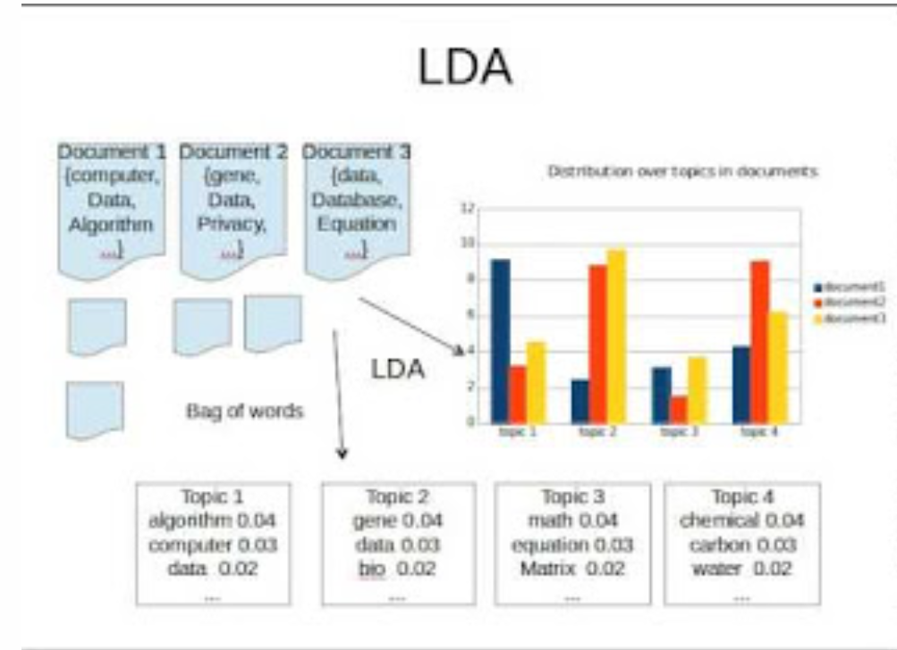

## Latent Dirichlet Allocation(LDA) 

LDA is a more recent (and more popular) method for topic modeling, compared to VSM, LSA, and pLSA. The main difference between pLSA and LDA is the incorporation of Bayesian concepts. LDA treats each document as a mixture of topics and each topic as a mixture of words.  LDA estimates both of these mixtures at the same time to find the mixture of topics that best describes each document. 
[LDA broken down](https://medium.com/@lettier/how-does-lda-work-ill-explain-using-emoji-108abf40fa7d)

LDA is great at producing easily understandable output. For example, if we search an ESPN database we might find that Topic 1 is best represented by "NFL, Super, Bowl, football, coach, quarterback" and Topic 2 is represented by "NBA, LeBron, Steph, Warriors, coach." If a new ESPN article is published, we could find the topic mixture for that article based on the information learned from our corpus. The ability to quickly interpret new articles is the main advantage over PLSA [(`r REF = REF + 1; REF`)](https://medium.com/nanonets/topic-modeling-with-lsa-psla-lda-and-lda2vec-555ff65b0b05). Those working with LDA use software to produce quick results. There are multiple packages that allow you to run LDA in R with two of the main packages being `lda` and `topicmodels`.

### Model

We consider that each document is made up of a number of topics and each topic is made up of a number of words. Integral to LDA is the use of Dirichlet priors for the document-topic and word-topic distributions. The Dirichlet distribution (after Peter Gustav Lejeune Dirichlet), denoted as ${\displaystyle \operatorname {Dir} ({\boldsymbol {\alpha }})}$, is a family of continuous multivariate probability distributions parameterized by a vector of concentration parameters $\alpha_i \in \mathbb{R}^+,\; \forall i\in \mathbb{N}$. It is a multivariate generalization of the beta distribution (and is sometimes called the multivariate beta distribution). Dirichlet distributions are often used as prior distributions in Bayesian statistics as they are conjugate for the categorical distribution and multinomial distribution. The Dirichlet Distribution is often called a "distribution of distributions" [(`r REF = REF + 1; REF`)](https://medium.com/nanonets/topic-modeling-with-lsa-psla-lda-and-lda2vec-555ff65b0b05). The general process is outlined in the figure below.

<center>
 [(`r REF = REF + 1; REF`)](https://medium.com/nanonets/topic-modeling-with-lsa-psla-lda-and-lda2vec-555ff65b0b05)
</center>

<center>
[(`r REF = REF + 1; REF`)](https://kdnuggets.com/2016/07/text-mining-101-topic-modeling.html)
</center>

As in other topic modeling methods, we choose $k$ to be the number of topics we want to represent each document in our corpus. However, in LDA there are the additional parameters $\alpha$ and $\beta$. While $\alpha$ relates to the prior weight of topic $k$ in a document, the other parameter $\beta$ relates to the prior weight of word $w$ in a topic. We usually set these to very low values such as 0.1 or 0.01 because we expect there to be few words per topic and few topics per document [(`r REF = REF + 1; REF`)](https://en.wikipedia.org/wiki/Latent_Dirichlet_allocation).


### Pros and Cons

<center>
[(`r REF = REF + 1; REF`)](https://ieeexplore.ieee.org/document/8250563)
</center>

### A "Simple" Example

This example examines the topics associated with tweets posted to Twitter. Specifically, we want to look at tweets with the following properties:

- Include a specific search term or hashtag
- Were posted within a specified time 
- Were posted by users in and around a specified region of the united states

If you want to do this yourself, you'll need to create your own [**Twitter Developer account**](https://developer.twitter.com/) and get issued the required set of API keys and tokens.  Then you can substitute your own tokens in the functions below to moke your own requests to the Twitter API.

In the chunk below I submit my personal token to setup OAuth authorization with the Twitter API (I'm letting them know who is making the requests). 

```{r, eval=FALSE}
# You'll need to get your own keys by 
# creating a Twitter developer account
twitter_consumer_key    <- jkf::key_chain('twitter.api')
twitter_consumer_secret <- jkf::key_chain('twitter.api.secret')
twitter_access_token    <- jkf::key_chain('twitter.token')
twitter_access_secret   <- jkf::key_chain('twitter.token.secret')

twitteR::setup_twitter_oauth(consumer_key    = twitter_consumer_key,
                             consumer_secret = twitter_consumer_secret,
                             access_token    = twitter_access_token,
                             access_secret   = twitter_access_secret)
```

The code in the next chunk is the workhorse function that gets the Tweets we want and returns them in a `data.frame` for easy analysis.

```{r}
get_tweets <- function(text = '#trump',
                       location = NULL,
                       dist = NULL,
                       units = NULL,
                       map_source = "google",
                       key = jkf::key_chain("gmapsAPI"),...) {

   lat_long_dist <- NULL
   locale <- NULL
  
if(!(is.null(location) | missing(location))) {
  
   lat_long <- ggmap::geocode(location,
                              source = map_source,
                              key = key)
   
   if(is.null(dist)  | missing(dist))  dist  = '20'
   if(is.null(units) | missing(units)) units = 'mi'
   
   lat_long_dist <- glue::glue("{lat_long[2]},{lat_long[1]},{dist}{units}")
   
   locale = 'ja'
   
}

tweets <- twitteR::searchTwitter(searchString = text, 
                                 geocode = lat_long_dist,
                                 locale = locale,...)

# Convert List of tweets to data.frame
tweet_df <- twitteR::twListToDF(tweets)

return(tweet_df)
                       
}
```

Then we use the function to get the tweets

```{r, eval=FALSE}
Tweets <- get_tweets(text = '#trump',
                       location = "Dayton, OH",
                       dist = "50",
                       units = "mi",
                       map_source = "google")
DT::datatable(Tweets)
```

## Data Prep

As you can see, there are three columns and 650 observations (Tweets). Next we'll transform the data to a Tidy data structure and list the most used words outside of stop words.

## Tidy

```{r, eval=FALSE}
Tidy_Tweets <- Tweets %>%
  tidytext::unnest_tokens(word,text) %>%
  dplyr::anti_join(tidytext::stop_words) %>%
  dplyr::add_count(word, sort = TRUE)
Tidy_Tweets
```

```{r, eval=FALSE}
dfm_Tweets <- Tidy_Tweets %>%
  tidytext::cast_dfm(id, word, n)
dfm_Tweets
```

Topic Model Using STM

```{r, eval=FALSE}
topic_model <- stm::stm(dfm_Tweets, K = 4, init.type = "LDA")

summary(topic_model)
```

## Visualization

```{r,eval=FALSE}
topic_model <- tidytext::tidy(topic_model)
```

We'll use ggplot to graph the beta to see which words are contributing the most to which topic

```{r,eval=FALSE}
 topic_model %>%
  group_by(topic) %>%
  top_n(7) %>%
  ungroup %>%
  mutate(term = reorder(term, beta)) %>%
  ggplot(aes(term, beta, fill = topic)) +
  geom_col(show.legend = FALSE) +
  facet_wrap(~topic, scales = "free") +
  coord_flip()
topic_model
```


```{r, eval=FALSE}
PUR_dfm <- quanteda::dfm(PUR_corpus,
                         remove = quanteda::stopwords("english"),
                         stem = !TRUE, 
                         remove_punct = TRUE)
```

```{r, eval=FALSE}
PUR_lda <- topicmodels::LDA(convert(PUR_dfm, to = "topicmodels"), k = 10)

topicmodels::get_terms(PUR_lda, 5)
```

Let's clean up our data

```{r}
PUR_en_edge_2015$extract <- qdap::mgsub(pattern = c("samsung","edge","phone","galaxy"), 
                                        replacement = "",
                                        text.var = tolower(PUR_en_edge_2015$extract))
```

```{r}
PUR_corpus <- quanteda::corpus(PUR_en_edge_2015$extract)
```

```{r}
quanteda::docvars(PUR_corpus, "date")    <- PUR_en_edge_2015$date
quanteda::docvars(PUR_corpus, "score")   <- PUR_en_edge_2015$score
quanteda::docvars(PUR_corpus, "source")  <- PUR_en_edge_2015$source
quanteda::docvars(PUR_corpus, "domain")  <- PUR_en_edge_2015$domain
quanteda::docvars(PUR_corpus, "product") <- PUR_en_edge_2015$product
quanteda::docvars(PUR_corpus, "country") <- PUR_en_edge_2015$country

DT::datatable(summary(PUR_corpus))
```


```{r, eval=FALSE}
PUR_dfm <- quanteda::dfm(PUR_corpus,
                         remove = quanteda::stopwords("english"),
                         stem = !TRUE, 
                         remove_punct = TRUE)
```

```{r, eval=FALSE}
PUR_lda <- topicmodels::LDA(convert(PUR_dfm, to = "topicmodels"), k = 10)

topicmodels::get_terms(PUR_lda, 5)
```