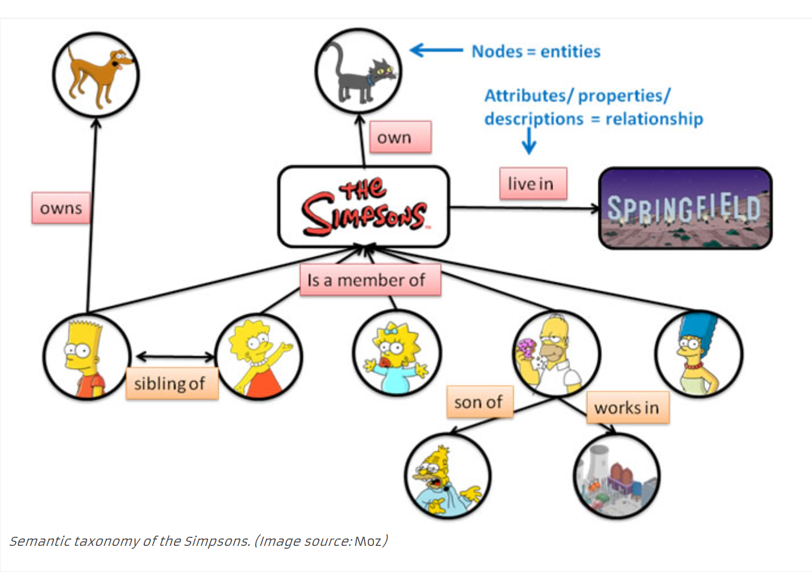
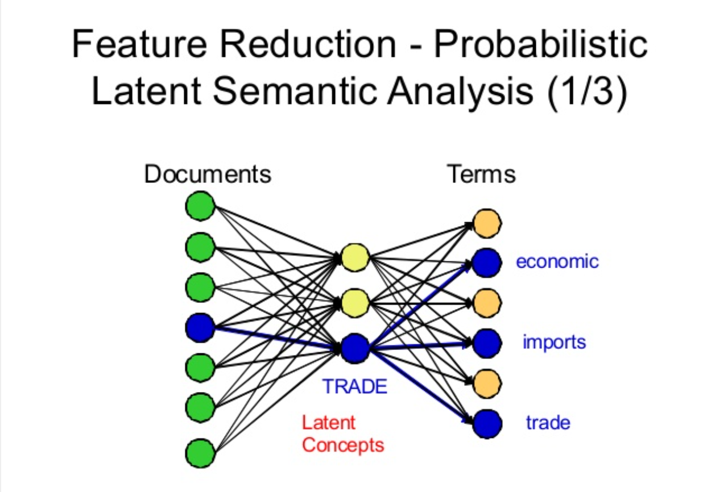
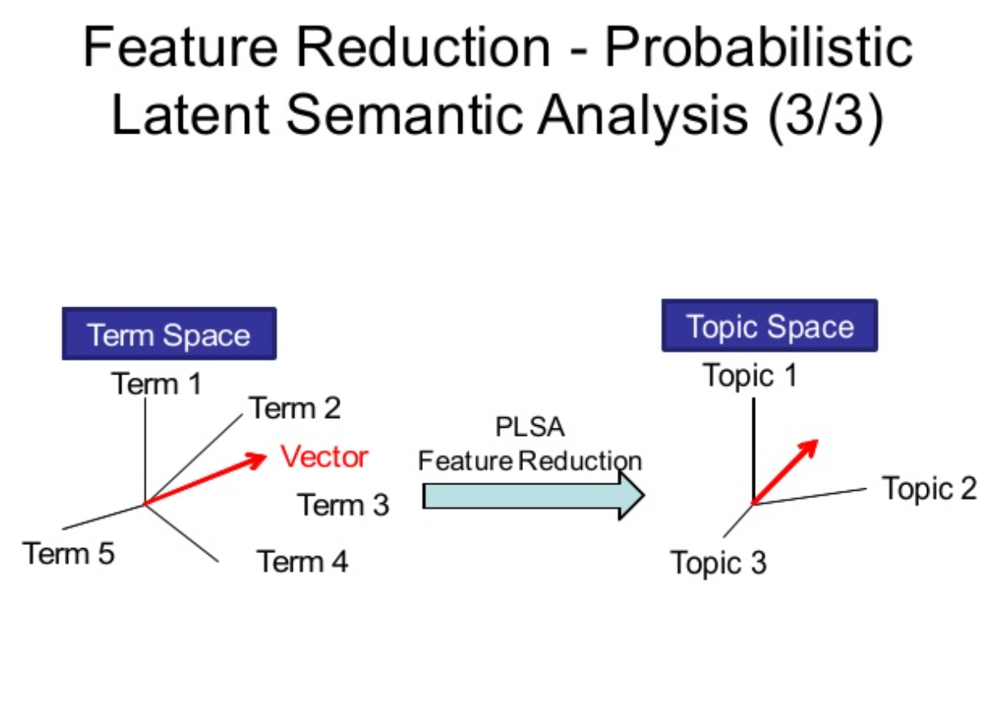

## Latent Semantic Indexing (LSI)/Latent Semantic Analysis (LSA)

<center>
[(`r REF = REF + 1; REF`)](https://www.popwebdesign.net/popart_blog/en/2018/07/latent-semantic-indexing/)
</center>

Latent Semantic Analysis (LSA) is an approach to automatic indexing and information retrieval that attempts to overcome some problems with VSM by mapping documents as well as terms to a representation in the so-called latent semantic space. LSA usually takes the (high-dimensional) vector space representation of documents based on term frequencies as a starting point and applies a dimension reducing linear projection. The specific form of this mapping is determined by a given document collection and is based on a singular value decomposition (SVD) of the corresponding document-term matrix. The general claim is that similarities between documents or between documents and queries can be more reliably estimated in the reduced latent space representation than in the original representation. The rationale is that documents which share frequently co-occurring terms will have a similar representation in the latent space, even if they have no terms in common. LSA thus performs some sort of noise reduction and has the potential benefit to detect synonyms as well as words that refer to the same topic. In many applications this has proven to result in more robust word processing. [(`r REF = REF + 1; REF`)](https://ieeexplore.ieee.org/document/8250563)

LSI (Latent Semantic Indexing) is a way that search engines determine whether your content is really on-topic and in-depth or just spam. The search engines determine this by looking at the words in an article and deciding how relevant they are to each other. 

An example is a web search of "windows." If you are searching for "windows", there are hundreds of related keywords that you can think of:

"Bill Gates"

"Microsoft"

"Windows 10"

"Surface tablet"

These keywords are naturally grouped together and rightly so as these are the potential LSI keywords when writing a post about "windows." LSI also helps to differentiate from the "other" windows:

"Window cleaning"

"Double glazed windows"

"Wooden windows"

"Window locks"
[(`r REF = REF + 1; REF`)](https://iamahmedkhalifa.com/blog/latent-semantic-indexing/)
  

### Probabilistic Latent Semantic Indexing (pLSI/pLSA)

<center>

 [(`r REF = REF + 1; REF`)](https://www.slideshare.net/JIAMINGCHANG/2008-0117-psldocslides)
</center>

Probabilistic Latent Semantic Indexing is a novel approach to automated document indexing which is based on a statistical latent class model for factor analysis of count data. Fitted from a training corpus of text documents by a generalization of the Expectation Maximization algorithm, the utilized model is able to deal with domain specific synonymy as well as with polysemous words. In contrast to standard Latent Semantic Indexing (LSI) by singular value decomposition, the probabilistic variant has a statistical foundation and defines a proper generative data model. Retrieval experiments on a number of test collections indicate substantial performance gains over direct term matching methods as well as over LSI. In particular, the combination of models with different dimensionalities has proven to be advantageous. [(`r REF = REF + 1; REF`)](http://delivery.acm.org/10.1145/320000/312649/p50-hofmann.pdf?ip=129.92.250.40&id=312649&acc=ACTIVE%20SERVICE&key=92909D146075CF59%2E296EECC507F02D9A%2E4D4702B0C3E38B35%2E4D4702B0C3E38B35&__acm__=1541182801_f7fbacceee3dcf5afd0b6ba73999fe0b)

### Model

In LSA, we use truncated singular value decomposition (SVD). SVD is a linear algebra technique that factorizes a matrix into three separate matrices. This method learns about the latent topics in the documents by performing matrix decomposition on the document-term matrix. It is intuitive that this matrix is very sparse and noisy, so we need to reduce dimensionality in order to find the relationships between words and documents. Like VSM, some people prefer to use the *tf-idf* values in the matrix. The formula for truncated SVD is as follows [(`r REF = REF + 1; REF`)](https://medium.com/nanonets/topic-modeling-with-lsa-psla-lda-and-lda2vec-555ff65b0b05).

$$
A = U_tS_tV_t^T
$$
One way to think about this process is that we are keeping the *t* most important dimensions, where *t* is a number we choose ahead of time based on how many topics we want to extract.

<center>
 [(`r REF = REF + 1; REF`)](https://medium.com/nanonets/topic-modeling-with-lsa-psla-lda-and-lda2vec-555ff65b0b05)
</center>

The $U$ matrix is in the term space and the V matrix is in the document space. The columns correspond to each of our topics. So if *t* is two, we keep two columns of each. With these matrices, we can then apply cosine similarity or other measures.

### A Simple Example

Consider the following documents [(`r REF = REF + 1; REF`)](http://manuel.midoriparadise.com/public_html/svd-lsi-tutorial.pdf).

1. "Shipment of gold damaged in a fire"
2. "Delivery of silver arrived in a silver truck"
3. "Shipment of gold arrived in a truck"

<center>
 [(`r REF = REF + 1; REF`)](http://manuel.midoriparadise.com/public_html/svd-lsi-tutorial.pdf)
</center>

```{r,echo=FALSE}
a <- matrix(c(1,1,1,0,1,1,1,0,0,0,1,0,1,0,0,1,0,1,1,1,1,1,1,1, 1,0,1,0,2,0,0,1,1), 11, 3,byrow=TRUE)
```

```{r}
mysvd <- svd(a)
(u <- mysvd$u)
(v <- mysvd$v)
(s <- diag(mysvd$d))

u %*% s %*% t(v)
```

As discussed earlier, U is our term-topic matrix and V is our document-topic matrix. If we want to look at two topics, we keep the first two columns of U and V and the first two rows and columns of S.

```{r}
(u <- u[,1:2])
(v <- v[,1:2])
(s <- s[1:2,1:2])
```

Let's look for the query "gold silver truck" using the following formula [(`r REF = REF + 1; REF`)](http://manuel.midoriparadise.com/public_html/svd-lsi-tutorial.pdf).

$$
q = q^TU_tS_t^{-1}
$$

```{r}
(q <- matrix(c(0,0,0,0,0,1,0,0,0,1,1), 11, 1,byrow=TRUE))
(q <- as.vector(t(q) %*% u %*% solve(s)))
```

We now have the coordinates of the query and the coordinates of each of the documents.

```{r}
(doc1 <- v[1,])
(doc2 <- v[2,])
(doc3 <- v[3,])
```

We now use the same process as before to find the most relevant document.

```{r}
(doc1 %*% q)/(sqrt(sum(doc1^2))*sqrt(sum(q^2)))
(doc2 %*% q)/(sqrt(sum(doc2^2))*sqrt(sum(q^2)))
(doc3 %*% q)/(sqrt(sum(doc3^2))*sqrt(sum(q^2)))
```

Document two would be the top result for this query. This can also be shown visually.

<center>
 [(`r REF = REF + 1; REF`)](http://manuel.midoriparadise.com/public_html/svd-lsi-tutorial.pdf)
</center>

## pLSA Model

### Model

The PLSA model was meant to improve upon LSA by adding probabilistic concepts. The model revolves around two main assumptions. Topic *z* is present in document *d* with probability $P(z|d)$ and word *w* is present in topic *z* with $P(w|z)$. The joint probability of seeing a document *d* and word *w* together is shown below [(`r REF = REF + 1; REF`)](https://medium.com/nanonets/topic-modeling-with-lsa-psla-lda-and-lda2vec-555ff65b0b05).

$$
P(D|W) = P(D)\sum_z{P(Z|D)P(W|Z)} = \sum_z{P(Z)P(D|Z)P(W|Z)}
$$

The terms on the right side are the parameters of the PLSA model. While some are learned through direct observation of the corpus, others are treated as multinomial distributions and are calculated using a process called expectation-maximization (EM). The first formulation is called the asymmetric formulation and the other is the symmetric formulation. The second formulation is perfectly symmetric in entities, documents and words [(`r REF = REF + 1; REF`)](https://en.wikipedia.org/wiki/Probabilistic_latent_semantic_analysis). The difference is that we start with the document and generate the topic and word with some probability in the first formulation. In the second, we start with a topic and then generate the document and the word. With the second formulation, there is a direct connection to LSA.

<center>
 [(`r REF = REF + 1; REF`)](https://medium.com/nanonets/topic-modeling-with-lsa-psla-lda-and-lda2vec-555ff65b0b05)
</center>

This connection makes clear that the only difference LSA and PLSA, as expected, is the inclusion of probabilistic concepts. The P(D|Z) term relates to U and the P(W|Z) term relates to V.

There are little to no openly available examples using PLSA. People interested in topic modeling seem to gravitate toward LSA or LDA.