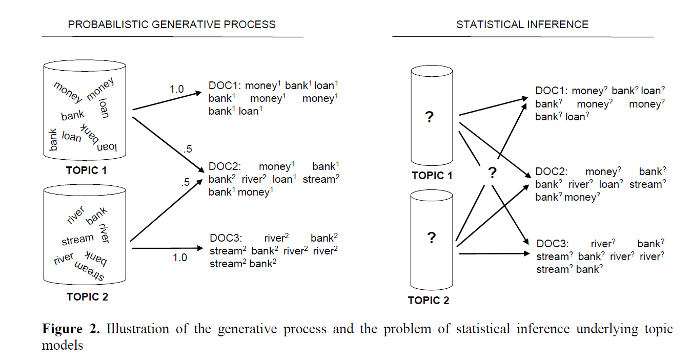

```{r setup1, echo=FALSE}
knitr::opts_chunk$set(echo = TRUE,
                      message = F,
                      comment = NA,
                      fig.align = "center")

REF <<- 0
```

## Background

Topic modeling is an <b>unsupervised</b> learning method used to discover "topics" across various text documents. Topic modeling is also useful when exploring large corpora to find clusters of words and/or similarities between documents. Finally, topic modeling is also used by search engines to match the topics found in a search string with documents and web pages that are centered around similar topics. 

It can model objects as latent topics that reflect the meaning of a collection of documents. The topic is viewed as a recurring pattern of co-occurring words. A topic includes a group of words that often occurs together. Topic modeling can link words with the same context and differentiate across the uses of words with different meanings. Some common methods of Topic Modeling include Vector Space Model (VSM), Latent Semantic Indexing (LSI), Probabilistic Latent Semantic Analysis (PLSA) and Latent Dirichlet Allocation (LDA). [`r REF = REF + 1; REF`](https://ieeexplore.ieee.org/document/8250563)

The goal of topic modeling is to identify "hidden concepts" that run through documents by analyzing the words contained within the texts. These topics are abstract in nature, i.e., words which are related to each other form a topic.  The basic idea can be thought about like this: 

> In a corpus, there exist $M$ documents denoted by $D_{i}, \;i = 1,2,...,M$ (each of these documents are visible to us)
>
> Each of these documents contain $N_{i}, \;i = 1,2,...,M$ words denoted by $w_{ij}, \; i = 1,2,...,M,\; j = 1,2,...N_{i}$ (each of these words are also visible to us)
>
> The question answered via topic modeling is: Why does document $i$ contain words $w_{ij}, \; j = 1,2,...N_{i}$?
>
> The answer is because there are <u>latent (unseen)</u> themes or "topics" running through each document and the words contained in each document are related to that topic.

Therefore, topic modeling can be thought of a dimensionality reduction technique in which we move from an $N \times M$ word-space to a much smaller topic-space.  This technique can be approached in two different ways:

1. Generative model (only information relevant to the model is the number of times words are produced)-bag of words assumption

2. Problem of statistical interference

<center>
[`r REF = REF + 1; REF`](http://psiexp.ss.uci.edu/research/papers/SteyversGriffithsLSABookFormated.pdf)
</center>

## Data Preparation

This document walks through various methods for topic modeling based on the `phone_user_reviews` data set.  To accomplish this we'll use the following packages.

```{r}
pacman::p_load(tidytext,
               tidyverse,
               quanteda,
               stm,
               topicmodels,
               lsa,
               here,
               DT,
               data.table,
               stringr,
               twitteR,
               httr,
               lubridate,
               ggmap)
```

With these packages installed and loaded into our workspace, we proceed to ingesting the `phone_user_reviews` data set and preparing it for our analyses.  This is done using the code in the chunks below.  In this first chunk we locate the directory containing the six (6) `.RData` files that contain the data, read the data from each object and bind the data together in one complete data object called `PUR` (for phone user reviews).

```{r, cache=T}
# Locate the root of our project
root <- here::here()

# From the root, find the directory of files
# and select those with the .RData extension
pur <- list.files(path = file.path(root,"data","phone_user_reviews"),
                  pattern = ".RData",
                  full.names = T)

# We don't know the name of the object inside of each .RData file
# So, we create a new environment and load the object there
# We know there's only one object in this environment
# So, we don't need to know the object's name
# We just use ls() to list the objects and then get() the first one
# Using get() reads in the object into the global environment
env <- new.env()
load(pur[1], envir = env)
PUR <- data.table::data.table(get(ls(envir = env)[1], envir = env))

# After we're done we destroy the new environment that we created 
rm(env)

# Then repeat the process for the other files
# We make sure to rbind() the rows of each object together 
for(i in 2:length(pur)){
  
    env <- new.env()
    load(pur[i], envir = env)
    PUR_i <- data.table::data.table(get(ls(envir = env)[1], envir = env))
     
    PUR = rbind(PUR,PUR_i)
    rm(env)
  
}
```

In this next chunk we subset the full data set that we created above to consider only those that are written in English.  Then we further subset this obejct to consider only those review that contain the words "samsung" and "edge" implying the review is about a Samsung-branded device with the name edge in the title.  Finally, we reformat the `date` column such that we can select only those reviews that were posted on or after January 1^st^ 2015 (the selected date is arbitrary). 

```{r}
PUR_en <- PUR[lang == "en" & country == "us"]

is_samsung <- stringr::str_detect(tolower(PUR_en$product), "samsung")

is_edge <- stringr::str_detect(tolower(PUR_en$product), "edge")

PUR_en_edge <- PUR_en[is_samsung & is_edge,]

PUR_en_edge[,date := as.Date(date, format = "%d/%m/%Y")]

PUR_en_edge_2015 <- PUR_en_edge[date > as.Date("1/1/2015",format = "%d/%m/%Y")]

DT::datatable(head(PUR_en_edge_2015, 100))
```

Next, we ingest the actual review, stored in the `extract` column as a quanteda `corpus`-class object using `corpus()`. 

```{r}
PUR_corpus <- quanteda::corpus(PUR_en_edge_2015$extract)
```

Finally, we recognize that there are other columns in the data set that provide additional context to the review.  We can store these as "document variables" using `docvars`, as shown below

```{r}
quanteda::docvars(PUR_corpus, "date")    <- PUR_en_edge_2015$date
quanteda::docvars(PUR_corpus, "score")   <- PUR_en_edge_2015$score
quanteda::docvars(PUR_corpus, "source")  <- PUR_en_edge_2015$source
quanteda::docvars(PUR_corpus, "domain")  <- PUR_en_edge_2015$domain
quanteda::docvars(PUR_corpus, "product") <- PUR_en_edge_2015$product
quanteda::docvars(PUR_corpus, "country") <- PUR_en_edge_2015$country

DT::datatable(summary(PUR_corpus))
```

```{r, child="VSM.Rmd", eval=T}
```

```{r, child="LSA.Rmd", eval=T}
```

```{r, child='LDA.Rmd', eval=T}
```

### References

1. [A Vector Space Model for Automatic Indexing](https://dl.acm.org/citation.cfm?id=361220) 
2. [An Overview of Topic Modeling Methods and Tools](https://ieeexplore.ieee.org/document/8250563) 
3. [Vector space model](https://en.wikipedia.org/wiki/Vector_space_model)
4. [Vector Space Retrieval Example](http://www.site.uottawa.ca/~diana/csi4107/cosine_tf_idf_example.pdf) 
5. [Topic Modeling with LSA, pLSA, LDA and lda2vec](https://medium.com/nanonets/topic-modeling-with-lsa-psla-lda-and-lda2vec-555ff65b0b05)
6. [SVD and LSI Tutorial](http://manuel.midoriparadise.com/public_html/svd-lsi-tutorial.pdf)
7. [Probabilistic latent semantic analysis](https://en.wikipedia.org/wiki/Probabilistic_latent_semantic_analysis)
8. [Latent Dirichlet allocation](https://en.wikipedia.org/wiki/Latent_Dirichlet_allocation)

