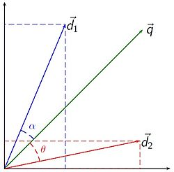

### VSM Model

#### Model

This model works by comparing vectors representing entire documents and queries. If there are *t* total terms, then the information from each document *D~i~* is contained in the following vector of *t* dimensions [(1)](https://dl.acm.org/citation.cfm?id=361220):

$$
D_i = (d_{i,1}, d_{i,2}, ... , d_{i,t}) 
$$
This is the document-term matrix. However, we typically like to work with the *tf_idf* weighting measure that we have already discussed in class to reflect the importance of each word [(2)](https://ieeexplore.ieee.org/document/8250563).

Recall that *tf*, term frequency, is simply the number of times each term appears in a document and that *idf*, inverse document frequency, concerns the number of times a term appears across all documents. The *idf* value is calculated as follows. 

$$
\mbox{idf}(t,D) = \log\left(\frac{N}{n_{t}}\right)
$$
The *tf-idf* value is then calculated as follows.


$$
\mbox{tf-idf}(t,d,D) = \mbox{tf}(t,d) \cdot \mbox{idf}(t,D)
$$

Words with high *tf-idf* values are used often in a document, but not very often throughout all the documents. We can then use methods like cosine similarity to compare document to document or query to document [(2)](https://ieeexplore.ieee.org/document/8250563).

$$
cos(q,d) = \frac{q.d}{||q||.||d||}
$$
We then rank the documents according to their similarity to the query. The cosine similarity concept can also be shown visually. 

<center>
 [(3)](https://en.wikipedia.org/wiki/Vector_space_model)
</center>

#### Example

Consider this example from the University of Ottawa [(4)](http://www.site.uottawa.ca/~diana/csi4107/cosine_tf_idf_example.pdf). There are three documents that only have three words each.

1. "new york times"
2. "new york post"
3. "los angeles times"

The *tf-idf* values are calculated according to the formula above. Below is an example calculation for "new." The word appears in two documents, once in the first and once in the second. This is a simple example because the term frequencies per document are all either 1 or 0, so the *tf-idf* values only depend on *idf*. Below are the calculations.

```{r}
new <- log2(3/2)
york <- log2(3/2)
times <- log2(3/2)
post <- log2(3/1)
los <- log2(3/1)
angeles <- log2(3/1)
```

The *tf-idf* matrix is then a collection of vectors representing each document.

$$
document = (new, york, times, post, los, angeles)
$$

```{r}
(doc1 <- c(new*1, york*1, times*1, post*0, los*0, angeles*0))
(doc2 <- c(new*1, york*1, times*0, post*1, los*0, angeles*0))
(doc3 <- c(new*0, york*0, times*1, post*0, los*1, angeles*1))
```

How similar are the documents?

```{r}
(doc1 %*% doc2)/(sqrt(sum(doc1^2))*sqrt(sum(doc2^2)))
(doc1 %*% doc3)/(sqrt(sum(doc3^2))*sqrt(sum(doc1^2)))
(doc2 %*% doc3)/(sqrt(sum(doc2^2))*sqrt(sum(doc3^2)))
```

Which document is most similar to the "new new times" query? To calculate *tf-idf* for a query, divide the frequency for that word by the maximum frequency for any word. 

```{r}
(query = c(new *(2/2), york*0, times*(1/2), post*0, los*0, angeles*0))
(doc1 %*% query)/(sqrt(sum(doc1^2))*sqrt(sum(query^2)))
(doc2 %*% query)/(sqrt(sum(doc2^2))*sqrt(sum(query^2)))
(doc3 %*% query)/(sqrt(sum(doc3^2))*sqrt(sum(query^2)))
```

As expected, document 1 would be the first result when searching this query.

### LSA Model

#### Model

In LSA, we use truncated singular value decomposition (SVD), a linear algebra technique that factorizes a matrix into three separate matrices. This method learns about the latent topics in the documents by performing matrix decomposition on the document-term matrix. It is intuitive that this matrix is very sparse and noisy, so we need to reduce dimensionality in order to find the relationships between words and documents. Like VSM, some people prefer to use the *tf-idf* values in the matrix. The formula for truncated SVD is as follows [(5)](https://medium.com/nanonets/topic-modeling-with-lsa-psla-lda-and-lda2vec-555ff65b0b05).

$$
A = U_tS_tV_t^T
$$
One way to think about this process is that we are keeping the *t* most important dimensions, where *t* is a number we choose ahead of time based on how many topics we want to extract.

<center>
 [(5)](https://medium.com/nanonets/topic-modeling-with-lsa-psla-lda-and-lda2vec-555ff65b0b05)
</center>

The U matrix is in the term space and the V matrix is in the document space. The columns correspond to each of our topics. So if *t* is two, we keep two columns of each. With these matrices, we can then apply cosine similarity or other measures.

#### Example

Consider the following documents [(6)](http://manuel.midoriparadise.com/public_html/svd-lsi-tutorial.pdf).

1. "Shipment of gold damaged in a fire"
2. "Delivery of silver arrived in a silver truck"
3. "Shipment of gold arrived in a truck"

<center>
 [(6)](http://manuel.midoriparadise.com/public_html/svd-lsi-tutorial.pdf)
</center>

```{r,echo=FALSE}
a <- matrix(c(1,1,1,0,1,1,1,0,0,0,1,0,1,0,0,1,0,1,1,1,1,1,1,1, 1,0,1,0,2,0,0,1,1), 11, 3,byrow=TRUE)
```

```{r}
mysvd <- svd(a)
(u <- mysvd$u)
(v <- mysvd$v)
(s <- diag(mysvd$d))

u %*% s %*% t(v)
```

As discussed earlier, U is our term-topic matrix and V is our document-topic matrix. If we want to look at two topics, we keep the first two columns of U and V and the first two rows and columns of S.

```{r}
(u <- u[,1:2])
(v <- v[,1:2])
(s <- s[1:2,1:2])
```

Let's look for the query "gold silver truck" using the following formula [(6)](http://manuel.midoriparadise.com/public_html/svd-lsi-tutorial.pdf).

$$
q = q^TU_tS_t^{-1}
$$

```{r}
(q <- matrix(c(0,0,0,0,0,1,0,0,0,1,1), 11, 1,byrow=TRUE))
(q <- as.vector(t(q) %*% u %*% solve(s)))
```

We now have the coordinates of the query and the coordinates of each of the documents.

```{r}
(doc1 <- v[1,])
(doc2 <- v[2,])
(doc3 <- v[3,])
```

We now use the same process as before to find the most relevant document.

```{r}
(doc1 %*% q)/(sqrt(sum(doc1^2))*sqrt(sum(q^2)))
(doc2 %*% q)/(sqrt(sum(doc2^2))*sqrt(sum(q^2)))
(doc3 %*% q)/(sqrt(sum(doc3^2))*sqrt(sum(q^2)))
```

Document two would be the top result for this query. This can also be shown visually.

<center>
 [(6)](http://manuel.midoriparadise.com/public_html/svd-lsi-tutorial.pdf)
</center>

### pLSA Model

#### Model

The PLSA model was meant to improve upon LSA by adding probabilistic concepts. The model revolves around two main assumptions. Topic *z* is present in document *d* with probability $P(z|d)$ and word *w* is present in topic *z* with $P(w|z)$. The joint probability of seeing a document *d* and word *w* together is shown below [(5)](https://medium.com/nanonets/topic-modeling-with-lsa-psla-lda-and-lda2vec-555ff65b0b05).

$$
P(D|W) = P(D)\sum_z{P(Z|D)P(W|Z)} = \sum_z{P(Z)P(D|Z)P(W|Z)}
$$
The terms on the right side are the parameters of the PLSA model. While some are learned through direct observation of the corpus, others are treated as multinomial distributions and are calculated using a process called expectation-maximization (EM). The first formulation is called the asymmetric formulation and the other is the symmetric formulation. The second formulation is perfectly symmetric in entities, documents and words [(7)](https://en.wikipedia.org/wiki/Probabilistic_latent_semantic_analysis). The difference is that we start with the document and generate the topic and word with some probability in the first formulation. In the second, we start with a topic and then generate the document and the word. With the second formulation, there is a direct connection to LSA.

<center>
 [(5)](https://medium.com/nanonets/topic-modeling-with-lsa-psla-lda-and-lda2vec-555ff65b0b05)
</center>

This connection makes clear that the only difference LSA and PLSA, as expected, is the inclusion of probabilistic concepts. The P(D|Z) term relates to U and the P(W|Z) term relates to V.

There are little to no openly available examples using PLSA. People interested in topic modeling seem to gravitate toward LSA or LDA. 

### LDA Model

#### Model

LDA is the newest and most popular method for topic modeling. As each successive method built on the previous one, their usefulness and complexity both increased. We will try to explain the mathematical concepts behind LDA as best we can.

The main difference between PLSA and LDA is the incorporation of Bayesian concepts. Again, we consider that each document is made up of a number of topics and each topic is made up of a number of words. Integral to LDA is the use of Dirichlet priors for the document-topic and word-topic distributions. The Dirichlet Distribution is a generalization of the Beta Disribution and is often called a "distribution of distributions" [(5)](https://medium.com/nanonets/topic-modeling-with-lsa-psla-lda-and-lda2vec-555ff65b0b05). The general process is outlined in the figure below.

<center>
 [(5)](https://medium.com/nanonets/topic-modeling-with-lsa-psla-lda-and-lda2vec-555ff65b0b05)
</center>

Like other methods, we choose the *k* number of topics we want to find. However, this time there are additional parameters $\alpha$ and $\beta$. While $\alpha$ relates to the prior weight of topic *k* in a document, the other parameter $\beta$ relates to the prior weight of word *w* in a topic. We usually set these to very low values such as 0.1 or 0.01 because we expect there to be few words per topic and few topics per document [(8)](https://en.wikipedia.org/wiki/Latent_Dirichlet_allocation).

LDA is great at providing output that is easily understandable. For example, if we search an ESPN database we might find that Topic 1 is best represented by "NFL, Super, Bowl, football, coach, quarterback" and Topic 2 is represented by "NBA, LeBron, Steph, Warriors, coach." If a new ESPN article is published, we could find the topic mixture for that article based on the information learned from our corpus. The ability to quickly interpret new articles is the main advantage over PLSA [(5)](https://medium.com/nanonets/topic-modeling-with-lsa-psla-lda-and-lda2vec-555ff65b0b05).

People who are working with LDA use software to produce quick results. There are multiple packages that allow you to run LDA in R with two of the main packages being *lda* and *topicmodels*. We will go through some examples during the next class.

### Pros and Cons

<center>
[(2)](https://ieeexplore.ieee.org/document/8250563)
</center>

### References

1. [A Vector Space Model for Automatic Indexing](https://dl.acm.org/citation.cfm?id=361220) 
2. [An Overview of Topic Modeling Methods and Tools](https://ieeexplore.ieee.org/document/8250563) 
3. [Vector space model](https://en.wikipedia.org/wiki/Vector_space_model)
4. [Vector Space Retrieval Example](http://www.site.uottawa.ca/~diana/csi4107/cosine_tf_idf_example.pdf) 
5. [Topic Modeling with LSA, pLSA, LDA and lda2vec](https://medium.com/nanonets/topic-modeling-with-lsa-psla-lda-and-lda2vec-555ff65b0b05)
6. [SVD and LSI Tutorial](http://manuel.midoriparadise.com/public_html/svd-lsi-tutorial.pdf)
7. [Probabilistic latent semantic analysis](https://en.wikipedia.org/wiki/Probabilistic_latent_semantic_analysis)
8. [Latent Dirichlet allocation](https://en.wikipedia.org/wiki/Latent_Dirichlet_allocation)

    