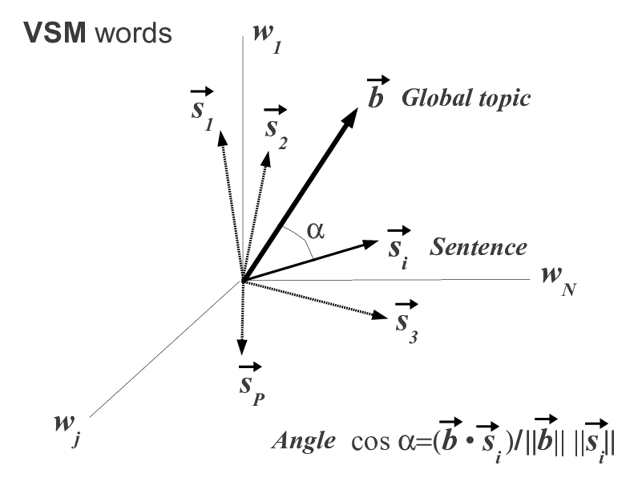
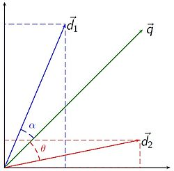

## Vector Space Model (VSM)

Vector space model is a typical solution for keyword searches. It represents each document as a vector where each entry in the vector corresponds to a different word and the value at that entry corresponds to some measure of how significant that word is in the document (example measures include the number of times a word is present in the document or the term-frequency inverse document frequency value associated with a word). [(`r REF = REF + 1; REF`)](https://ieeexplore.ieee.org/document/8250563)

### Model Overview

This model works by comparing vectors each of which represent an entire document and query.  Thus, if document $i$ contains $t$ total words, then the information within document $D_{i}$ can be represented by the following length $t$ vector [(`r REF = REF + 1; REF`)](https://dl.acm.org/citation.cfm?id=361220):

$$
D_i = (d_{i,1}, d_{i,2}, ... , d_{i,t}) 
$$

<center>
[(`r REF = REF + 1; REF`)](https://www.researchgate.net/figure/The-global-topic-in-a-Vector-Space-Model-of-N-words_fig1_232144781)
</center>

This is the document-term vector for document $i$.  If we join the document-term vectors for every document in our corpus we have the document-term matrix.  For each element in our document-term matrix we typically like to work with the *tf_idf* weighting measure that we have already discussed in class to reflect the relative importance of each word [(`r REF = REF + 1; REF`)](https://ieeexplore.ieee.org/document/8250563). Recall that *tf*, term frequency, is simply the number of times each term appears in a document and that *idf*, inverse document frequency, concerns the number of times a term appears across all documents. The *idf* value is calculated as follows. 

$$
\mbox{idf}(t,D) = \log\left(\frac{N}{n_{t}}\right)
$$

The *tf-idf* value is then calculated as follows.

$$
\mbox{tf-idf}(t,d,D) = \mbox{tf}(t,d) \cdot \mbox{idf}(t,D)
$$

Words with high *tf-idf* values are used often in a subset of the documents in the corpus, but not very often throughout all the documents. We can then use methods like cosine similarity to compare documents or queries [(`r REF = REF + 1; REF`)](https://ieeexplore.ieee.org/document/8250563).

$$
cos(q,d) = \frac{q.d}{||q||.||d||}
$$

We then rank the documents according to their similarity to the query. The cosine similarity concept can also be shown visually. 

<center>
 [(`r REF = REF + 1; REF`)](https://en.wikipedia.org/wiki/Vector_space_model)
</center>

### A Simple Example

Consider [**this example**](http://www.site.uottawa.ca/~diana/csi4107/cosine_tf_idf_example.pdf) from the University of Ottawa which considers three documents - each containing three words.

1. "new york times"
2. "new york post"
3. "los angeles times"

The *tf-idf* values are calculated according to the formula above. Below is an example calculation for "new." The word appears in two documents, once in the first and once in the second. This is a simple example because the term frequencies per document are all either 1 or 0, so the *tf-idf* values only depend on *idf*. Below are the calculations.

```{r}
new     <- log(3/2)
york    <- log(3/2)
times   <- log(3/2)
post    <- log(3/1)
los     <- log(3/1)
angeles <- log(3/1)
```

The *tf-idf* matrix is then a collection of vectors representing each document.

$$
\text{document = (new, york, times, post, los, angeles)}
$$

```{r}
(doc1 <- c(new*1, york*1, times*1, post*0, los*0, angeles*0))
(doc2 <- c(new*1, york*1, times*0, post*1, los*0, angeles*0))
(doc3 <- c(new*0, york*0, times*1, post*0, los*1, angeles*1))
```

How similar are the documents?

```{r}
(doc1 %*% doc2) / (sqrt(sum(doc1 ^ 2)) * sqrt(sum(doc2 ^ 2)))
(doc1 %*% doc3) / (sqrt(sum(doc3 ^ 2)) * sqrt(sum(doc1 ^ 2)))
(doc2 %*% doc3) / (sqrt(sum(doc2 ^ 2)) * sqrt(sum(doc3 ^ 2)))
```

Which document is most similar to the "new new times" query? To calculate *tf-idf* for a query, divide the frequency for that word by the maximum frequency for any word. 

```{r}
(query = c(new * (2/2), york * 0, times * (1 / 2), post * 0, los * 0, angeles * 0))
(doc1 %*% query) / (sqrt(sum(doc1 ^ 2)) * sqrt(sum(query ^ 2)))
(doc2 %*% query) / (sqrt(sum(doc2 ^ 2)) * sqrt(sum(query ^ 2)))
(doc3 %*% query) / (sqrt(sum(doc3 ^ 2)) * sqrt(sum(query ^ 2)))
```

As expected, document 1 would be the first result when searching this query.